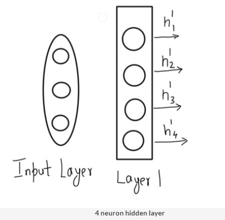

# Structure of Neural Networks

## Introduction

Welcome to the course on **Neural Networks**.

In this module, you will learn what are arguably the most sophisticated and cutting-edge models in machine learning - **Artificial Neural Networks or ANNs**. Inspired by the structure of the human brain, neural networks have established a reputation for successfully learning complex tasks such as object recognition in images, automatic speech recognition (ASR), machine translation, image captioning, video classification etc.

By the end of this module, you will be able to understand the working principles of artificial neural networks  - information flow in **feedforward networks**, training using **backpropagation**, **optimisation techniques, hyperparameter tuning** etc. You will also learn the **practical aspects** of training large neural networks.

In the last session, you will learn to implement neural networks using Keras (a high-level, user-friendly interface) with Tensorflow (the low-level workhorse library) as the backend.

Finally, by the end of this module, you will be able to **build your own neural network** from scratch using Numpy.

### In this session
To begin with, you will get an intuitive idea about neural networks in this session. You will study:
* The inspiration for ANNs from the brain
* The perceptron - a simple idea as the basis for larger neural networks
* How artificial neurons work
* The structure and topology of neural networks
* Hyperparameters and simplifying assumptions

### Neural Networks - Inspiration from the Human Brain
As the name suggests, the design of **Artificial Neural Networks (ANNs)** is inspired by the human brain. Although not as powerful as the brain (yet), artificial neural networks are the most powerful learning models in the field of machine learning.

In the past few years, **deep artificial neural networks** have proven to perform surprisingly well on complex tasks such as speech recognition (converting speech to text), machine translation, image and video classification, etc. Such models are also commonly called **deep learning** models.

Let’s begin our journey into deep learning with an introduction to artificial neural networks.

Some of the ealier bottlenecks with Neural Networks are:

Artificial neural networks are said to be inspired by the structure of the brain. Let’s first understand the basic structure of the brain, the structure of a neuron and how information travels through neurons.

Brain is made of several billions of neurons. Each neuron has input coming from multiple other neurons. 

Simply speaking, the biological neuron works as follows - it receives signals through its **dendrites** which are either **amplified** or **inhibited** as they pass through the **axons** to the dendrites of other neurons.

Let’s now look at how an Artificial Neural Network is similar to the human brain.

To summarise, the main bottleneck in using neural networks is the availability of abundant training data. The neural networks have applications across various domains such as images and videos (computer vision), text, speech, etc. Note that the words deep learning and neural networks are often used interchangeably.

To summarise, Artificial Neural Networks, are a collection of a large number of simple devices called **artificial neurons**. The network ‘learns’ to conduct certain tasks, such as recognising a cat, by **training the neurons** to ‘fire’ in a certain way when given a particular input, such as a cat. In other words, the network learns to **inhibit or amplify** the input signals in order to perform a certain task, such as recognising a cat, speaking a word, identifying a tree etc.  

In the next segment, you will study the **perceptron**. The perceptron was one of the earliest proposed models for learning simple classification tasks which later on became the fundamental building block of artificial neural networks.

### Introduction to Perceptron
In this segment, you will study a simple device called the **perceptron** which was the first step towards creating the large neural networks we have today. Let's take a quick example to understand how a perceptron works.

Consider a sushi place you plan to visit on the coming Saturday. There are various factors that would affect this decision, such as:
1. How far is it?
2. How costly is it?
3. How many people are accompanying you?

You take a decision based on multiple such factors. Also, each decision factor has a different ‘weight’ - for example, the distance of the place might be more important than the number of people. 

Perceptrons work in a similar way. They take some signals as inputs and perform a set of simple calculations to arrive at a decision. Let’s study perceptrons in some detail.

To summarise, the perceptron takes a **weighted sum** of multiple inputs (along with a bias) as the cumulative input and applies a **step function** on the cumulative input, i.e. it returns 1 if the input is positive, else -1. In other words, the perceptron “fires” (returns 1) if the cumulative input is positive and "stays dormant" (returns 0) if the input is negative.

Note that there are different ways to define the step function. We have considered a step function defined in the following way, though one can rather use 1 and -1 as well instead of 1 and 0:

 The input to a perceptron is the sum of weights multiplied with their respective inputs and the bias:

 

 Shortly, we will be talking about everything in terms of vectors and matrices, so let's start using the vector algebra lingo. Say **w** and **x** are vectors representing the weights and inputs as follows (note that, by default, a vector is assumed to be a column vector):

 

 

 ### Perceptron as a Classifier
Now that you understand the design of a perceptron, think about how it can be used for simple learning tasks. To start with, consider a simple **binary classification** task and spend a few minutes thinking about how the perceptron can work as a classifier.

In the following lecture, you will understand how the perceptron can act as a classifier.

 

 You saw how the perceptron works as a classifier. The weights represent the importance of the corresponding feature for classification. You might have also noticed that we has used a **sign function**. The 'sign function' is similar to the step function - it outputs +1 when the input is greater than 0 and -1 otherwise. In a binary classification setting, +1 and -1 represent the two classes.

 ### Binary Classification using Perceptron
 In the previous segment, we learned the design of a perceptron. In this segment, we will learn how perceptrons can be trained to perform certain tasks. But first, let's formally define the problem statement and fix some notations we'll be using throughout this session.

 The perceptron problem statement is defined as follows:

 

 

 

 Before we move on, let us first tweak our representation a little to **homogenous coordinates** which will help us in formulating the perceptron solution more neatly.

### Perceptrons - Training
Now that you understand the basics of perceptron, let’s look at the iterative solution suggested by Rosenblatt for **training the perceptron**.

To summarise, Rosenblatt suggested an elegant iterative solution to train the perceptron (i.e. to learn the weights):

You have seen how we performed the 1st iteration to get **w1**. Notice that the line moves in the right direction, though it misclassifies two orange points now (and passes through one).

This is a simple way to understand the intuition behind the algorithm. You can go through the mathematics of the proof in the additional reading section.

You have seen how a perceptron performs binary classification but wouldn't it be amazing if these simple devices could do something more complex? Let's see how a group of perceptrons can do multiclass classification in the next segment.

**Additional Readings:**
* Please find the proof of learning algorithm of the perceptron [here](https://www.cse.iitb.ac.in/~shivaram/teaching/old/cs344+386-s2017/resources/classnote-1.pdf).

### Multiclass Classification using Perceptrons
Until now, you have seen how a perceptron performs binary classification. But if that were the only task a perceptron (or a collection of them) could do, we wouldn’t have cared much about them. It turns out that they can do much more complex things, such as **multiclass classification**. Let’s see how a set of perceptrons can perform more complex tasks.

We see how a network of perceptrons can act as a **universal function approximator**. We have seen how a single layer of perceptron in combination with an AND gate leads to an enclosure in a polygon, and multiple such AND outputs using an OR gate lead to an enclosure in multiple polygons. In the most extreme case, this can be extended to finding a polygon for every single data point.

Now that we have understood how networks of simple perceptrons can act as universal function approximators, let’s start our journey of learning artificial neural networks.

### Working of a Neuron
With an understanding of perceptrons, you are now equipped to study the design of **Artificial Neural Networks (ANNs)**.

Neural networks are a collection of artificial neurons arranged in a particular structure. In this segment, you will understand how an artificial neuron works i.e. how it converts inputs into outputs. You will also understand the **topology** or the structure of large neural networks.

So we see that a neuron is very similar to a perceptron, the only difference being that there is an **activation function** applied to the weighted sum of inputs. In perceptrons, the activation function is the **step function**, though, in artificial neural networks, it can be any non-linear function (we’ll study commonly used activation functions shortly).

Let's now look at how large neural networks are designed using multiple individual neurons.

Neurons in a neural network are arranged in **layers**. The first and the last layer are called the **input and output** layers. Input layers have as many neurons as the number of attributes in the data set and the output layer has as many neurons as the number of classes of the target variable (for a classification problem). For a regression problem, the number of neurons in the output layer would be 1 (a numeric variable).

Let's now look at what it means to specify a neural network completely, i.e. what all we need to specify to completely describe a neural network.

There are six main things that need to be specified for specifying a neural network completely:
1. Network Topology
2. Input Layer
3. Output Layer
4. Weights
5. Activation functions
6. Biases

You might have some questions such as "how to decide the number of neurons in the input layer", "how are weights and biases specified", etc. You will be able to answer these questions in the next few segments.

### Inputs and Outputs of a Neural Network I
You saw that the number of neurons in the input layer is determined by the input given to the network and that the number of neurons in the output layer is equal to the number of classes (for a classification task) and equal to one (for regression tasks). Let’s now look at some example use cases to understand the input and outputs of ANNs better.

The most important thing to notice is that the inputs can only be numeric. For different types of input data, we use different ways to convert the inputs to a numeric form.

Feeding **images** (or videos) is straightforward since images are naturally represented as **arrays of numbers**. These numbers are the raw **pixels** of the image. Pixel is short for picture element. In images, pixels are arranged in rows and columns (an array of pixel elements). The figure below shows an image of a handwritten 'zero' in the MNIST dataset (black and white) and its corresponding representation in Numpy as an array of numbers. The pixel values are high where the **intensity** is high, i.e. the colour is white-ish, while they are low in the black regions. 

In a neural network, each **pixel** of the input image is a **feature**. For example, the image above is an 18 x 18 array. Hence, it will be fed as a **vector of size 324** to the network.

Note that the image above is a **black and white** image (also called **greyscale image**), and thus, each pixel has only one ‘channel’. If it were a **colour image** (called an RGB image - Red, Green, Blue), each pixel would have **three channels** - one each for red, blue and green as shown below. Hence, the number of neurons in the input layer would be 18 x 18 x 3 = 972. You’ll learn about this in detail in the next module on Convolution Neural Networks.

Now that you have looked at how to feed input vectors to neural networks, let’s study how the **output layers** are specified.

In this segment, you were introduced to the **softmax output**. A softmax output is a **multiclass logistic function** commonly used to compute the 'probability' of an input belonging to one of the multiple classes. It is defined as follows:

The softmax function stated above is a general case for multiclass classification. Let’s see how the softmax function translates to a **sigmoid function** in the special case of **binary classification** in the next segment.

**Additional Reading:**
* You can go through [this book](http://neuralnetworksanddeeplearning.com/chap1.html) to understand more about recognizing handwritten digits

### Inputs and Outputs of a Neural Network II
You have seen how we can define the inputs and outputs of a neural network. In this segment, we shall see how we can define the inputs and outputs for the famous MNIST dataset for the multiclass classification. But first, let's see how the softmax function translates to a **sigmoid function** in the special case of **binary classification**:

Let's see how we would define inputs and outputs for image recognition on the famous MNIST dataset.

There are various problems you face while trying to recognise handwritten text using an algorithm such as:
* Noise in the image
* The orientation of the text
* Non-uniformity in the spacing of text
* Non-uniformity in handwriting. 

The MNIST dataset takes care of some of these problems since the digits are written in a box. Now the only problem the network needs to take care of the non-uniformity in handwriting.  Since the images in the MNIST dataset are 28 X 28 pixels, the input layer has 784 neurons (each neuron takes 1 pixel as input) and the output layer has 10 neurons each giving the probability of the input image belonging to any of the 10 classes.  The image is classified to the class represented by the neuron with the highest probability. 

### Assumptions made to Simplify Neural Networks
Since large neural networks can potentially have extremely complex structures, certain assumptions are made to simplify the way information flows in them. Let’s explain some of the most common assumptions.

To summarise, commonly used neural network architectures make the following simplifying assumptions:
1. Neurons are **arranged in layers** and the layers are arranged **sequentially**.
2. Neurons **within the same layer do not interact** with each other.
3. All the inputs enter the network through the **input layer** and all the outputs go out of the network through the **output layer**.
4. Neurons in consecutive layers are **densely connected**, i.e. all neurons in layer ***l*** are connected to all neurons in layer ***l+1***.
5. **Every interconnection** in the neural network has a **weight** associated with it, and **every neuron has a bias** associated with it.
6. All neurons in all layers use the **same activation function**.

Having specified the basic assumptions in the architecture of ANNs, let's now study how neural networks are trained and used to make predictions. In the next segment, you will study the **hyperparameters and parameters** of neural networks.

### Parameters and Hyperparameters of Neural Networks
Neural networks require rigorous training. But what does it mean to train neural networks? What are the **parameters** which the network learns during training, and what are the **hyperparameters** which you (as the network designed) need to specify beforehand?

Recall that models such as linear regression, logistic regression, SVMs etc. are trained on their coefficients, i.e. the training task is to find the optimal values of the coefficients to minimise some cost function. 

Neural networks are no different - they are trained on **weights and biases**.   

In this segment, you will study the parameters which are learnt during neural network training. You will also get a broad understanding of how the learning algorithm is trained.

During training, the neural network learning algorithm fits various models to the training data and selects the best model for prediction. The learning algorithm is trained with a **fixed set of hyperparameters** - the network structure (number of layers, number of neurons in the input, hidden and output layers etc.). It is trained on the **weights and the biases**, which are the parameters of the network.

Let's now have a closer look at the **hyperparameters** - the number of neurons in the input and the output layers, activation functions, the number of layers etc. We'll also fix some notations which we will use throughout the upcoming segments.

The following segment have defined the symbols and explained them using the MNIST dataset as an example. 

### Activation Functions
In the previous segments, you studied the topology, the underlying simplifying assumptions and the hyperparameters and parameters of neural networks. You will now understand how the output is calculated from a single neuron using an **activation function** and various types and properties of common activation functions.

The activation function could be any function, though it should have some important properties such as:

Activation functions should be smooth i.e. they should have no abrupt changes when plotted.

They should also make the inputs and outputs non-linear with respect to each other to some extent. This is because non-linearity helps in making neural networks more compact.   

To summarise, the activation function could be any function, though it should have some important properties such as:
* Activation functions should be **smooth** i.e. they should have no abrupt changes when plotted.
* They should also make the inputs and outputs **non-linear** with respect to each other to some extent. This is because non-linearity helps in making neural networks more compact.   

The most popular activation functions used for neural networks are:

You can also show that in a sigmoid neuron, if you multiply the weights and biases by a positive constant c>0, as the limit as c→∞ the behaviour of this sigmoid neurons is exactly the same as that of a perceptron, given w⋅x+b≠0 for the input x.

## Feed Forward in Neural Networks

### Introduction
Welcome to the second session on **Feedforward Neural Networks**.

In the previous session, you understood the architecture of neural networks and their inspiration from the brain. You also learnt the working of an artificial neuron, the hyperparameters and parameters of neural networks and various simplifying assumptions.

In this session, you will learn how information flows in a neural network from the input layer to the output layer. The information flow in this direction is often called **feedforward**.

### Flow of Information in Neural Networks - Between 2 Layers
In the previous session, you learnt about the structure, topology, hyperparameters and the simplifying assumptions of neural networks. In this segment, you will understand how the information flows from one layer to the adjacent one in a neural network.  

In artificial neural networks, the output from one layer is used as input to the next layer. Such networks are called **feedforward neural networks**. This means there are no loops in the network - information is always fed forward, never fed back. Let’s start off with understanding the feedforward mechanism between two layers. For simplicity, we have taken the input and the first layer to demonstrate how information flows between any two layers.

You learnt how information flows from one layer to another. We have the two layers as follows:

### Information Flow - Image Recognition
Let’s now study the feedforward algorithm using a small example. We will take the example of a 2-pixel x 2-pixel greyscale image. We will discuss a simple network whose task is to compute an amplified count of the number of grey (or 'on') pixels in the image.

In the example discussed, the objective of the network is to calculate the amplified count (or number) of 'on' pixels in the 2 x 2 image. Note that the outputs of hidden layers in large, real networks are not usually interpretable, we have used this example only to get an intuitive understanding of the feedforward process.

The first hidden layer in the network counts the number of grey pixels in the image - the first and the second neurons count the number of grey pixels in row-1 and row-2 respectively. Since the input is a 2 x 2 image, and the first hidden layer has two neurons, the weight matrix associated with it is of dimensions 2 x 4:

Note that we have assumed that all the biases are 0 and that we have used the trivial identity activation function which is a passthrough function.

### Feedforward Algorithm
Having understood how the information flows in the network, let’s write the **pseudocode for a feedforward pass** through the network for a single data point ***xi***. This will help you implement your own neural network in Numpy.

Until now, we have been doing feed forward for one single data point at a time (i.e. a single image, in case of the MNIST dataset). But the training data may have millions of data points. For e.g., the MNISt dataset itself has about 60,000 images in the training set.

Let’s now study how to do feed forward for an **entire batch of data points** in one go. We will use vectorized computation techniques which you will study in the next segment.

### Vectorized Feedforward Implementation
In the previous segment, we had written pseudocode for doing feedforward for a single data point ***xi*** at a time. Of course, training data has multiple data points, and we need to perform feedforward computation for all of them. 

A bad way to do that would be to write a 'for loop' iterating through all the data points. As the data scientist inside you would have guessed, there must be a more efficient way of doing it. 

Let’s now study how to do feed forward for an **entire batch of data points** in one go using **vectorized computation techniques**.

**Vectorized implementation** means to perform the computation (here, feedforward) for multiple data points using matrices. This will be much quicker than looping through one data point at a time.

Before we move to the vectorized implementation, let’s try writing the feedforward pseudocode for a set of **m** data points using a 'for loop':

You can see that we require two nested 'for loops'. This will become computationally quite expensive if we have a large dataset (which is often the case with neural networks).

Now let’s understand how doing the same using **matrices** can be much efficient.

### Understanding Vectorized Feedforward Implementation
In the previous segment, you saw how multiple data points can be fed forward as a batch. In this segment, we will try to make sense of the matrix multiplications mentioned in the feedforward algorithm. Let’s go through some nice properties and tricks of matrix multiplication in this lecture:

Let’s try to understand the block matrix multiplication using some examples. It would be convenient for you to use numpy to do the following matrix calculations. To compute matrix multiplication of A and B, you need to write numpy.dot(A, B) in python. Hence, this product is often referred to as the dot product of matrices.

